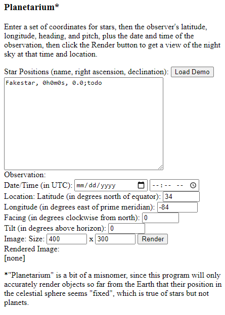

Planetarium
===========

The code in this repository partially implements a "planetarium", which will take the time, location, and orientation of an observer and display a view of the night sky matching those criteria.

As of this writing, this is an uncompleted work in progress.

